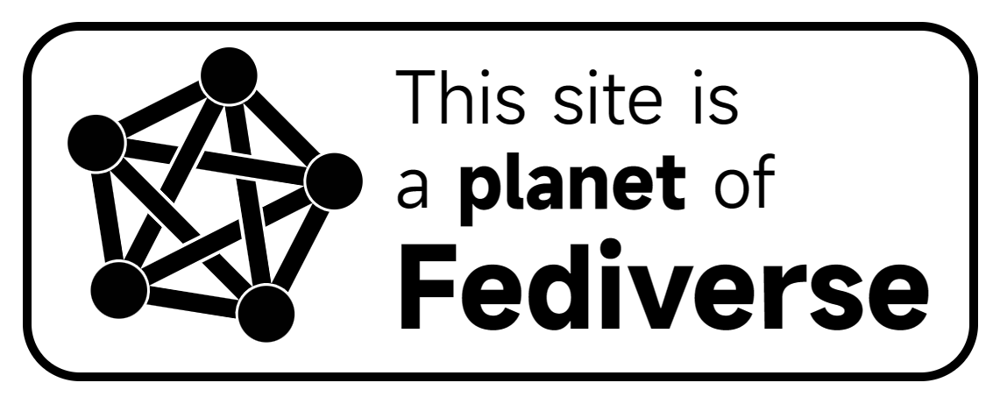

<div align="center">


**Wand is yet another open-source ActivityPub relay, in Python. 😘**

----


[](https://codecov.io/github/mattholy/wand)


[](https://codeberg.org/teaserbot-labs/delightful)

----

[🇬🇧English](README.md) | [🇨🇳中文](README_zh-CN.md)

----


</div>

----

<div>

## Philosophy & Features

### Connecting Through the Fediverse

The internet, humanity's grandest achievement in history, now spans like a vast ocean of stars, tightly connecting the farthest reaches of the world. It has accelerated the spread of knowledge and information, enabling people in every corner of the globe to glimpse the full panorama of our world. However, this digital realm, originally limitless and open for sharing, is gradually losing its true spirit. Various corporations and government institutions are building walls and barriers within this expansive network, turning our once interconnected world into a series of isolated islands. The voices on YouTube cannot leap to Bilibili, messages from WeChat cannot directly reach WhatsApp users, and insights from Reddit cannot freely flow to 2ch forums. This is an era of internet fragmentation!

We long for the golden age of the internet, an era tethered by email, where every message could travel freely through standardized protocols between different service providers. The internet was meant to be this free and open. Therefore, in this era of fragmented networks, we bear a significant responsibility to create new digital bonds, reconnecting this broken world. ActivityPub and the burgeoning Fediverse it fosters are rising. In this new digital universe, all forms of communication will adhere to a unified standard protocol. Servers, interconnecting like galaxies, will enable everyone to reach any corner of the globe from their own little world. As it should be.

Wand, as a strand in the Fediverse, will devote all its strength to tirelessly work for the connection and integration of this world. We are committed to reweaving this fragmented world, to reconnect information once again. This is our mission and our promise for the future—a new era of a boundless, shared, and free internet.

### Wand Provides

- Ability to connect each other as a relay or a strand
- Ability to see the Fediverse your Wand connected
- Dashboard to view data stats, like how many services your Wand connected
- Easy-to-use modern interface
- Distributed deployment, easy to scale
- Discover other Wand in Fediverse
- GPG identity, not username/password, for security
- Anti-spam
- Both forward and broadcast
- A stats about your fediverse

</div>


<div style="clear: both;"></div>

## Getting Start with hosting a Wand
ActivityPUB **need** to connect through https while Wand is a naive python ASGI.

So you have to deploy a [TLS Termination Proxy](https://en.wikipedia.org/wiki/TLS_termination_proxy) server in front of Wand. There are several choice:
- Traefik
- Caddy
- Nginx
- HAProxy
- Cloudflare Tunnel

### Docker Compose (Recommended)
Use a `docker-compose.yml` to deploy wand, recommended file as follow (**Change environment for your own !**) :
```yaml
version: "3.8"
services:
  wand:
    image: mattholy/wand:latest
    hostname: wand
    container_name: Wand
    # ports:
    #   - 80:80
    # We don't need ports forwarding this time
    volumes:
      - /etc/timezone:/etc/timezone:ro
      - /etc/localtime:/etc/localtime:ro
    environment:
      - WD_SERVER_URL=your.domain.name # Change this for your own
      - WD_REDIS_SERVER=redis
      - WD_REDIS_PORT=6379 # Optional, default is 6379
      - WD_REDIS_PWD=redis # Optional, default is None
      - WD_POSTGRES_SERVER=wand-postgres
      - WD_POSTGRES_PORT=5432 # Optional, default is 5432
      - WD_POSTGRES_DBNAME=wand # Change this for your own
      - WD_POSTGRES_USER=wand # Change this for your own
      - WD_POSTGRES_PWD=wand # Change this for your own
    restart: always
    depends_on:
      - wand-redis
      - wand-postgres

  wand-redis:
    image: redis
    hostname: wand-redis
    container_name: Wand-Redis
    volumes:
      - /etc/timezone:/etc/timezone:ro
      - /etc/localtime:/etc/localtime:ro
      - ./data/redis:/data # This is where your data stored
      - ./data/redis.conf:/usr/local/etc/redis/redis.conf
    command: ["redis-server","/usr/local/etc/redis/redis.conf"]
    # ports:
    #   - 6379:6379
    # We don't need ports forwarding this time
    restart: always

  wand-postgres:
    image: postgres
    hostname: wand-postgres
    container_name: Wand-Postgres
    volumes:
      - /etc/timezone:/etc/timezone:ro
      - /etc/localtime:/etc/localtime:ro
      - ./data/db:/var/lib/postgresql/data # This is where your data stored
    environment:
      POSTGRES_USER: wand # Change this for your own
      POSTGRES_DB: wand # Change this for your own
      POSTGRES_PASSWORD: wand # Change this for your own
    # ports:
    #   - 5432:5432
    # We don't need ports forwarding this time
    restart: always
```
And my `./data/redis.conf` looks like :
```
appendonly yes
```

Then run `docker compsoe up -d` to start your service.

Finally, access `https://your.domain.name` to configure further options.
#### GPG Key
*You can pass this section if you know this already.*

Wand uses GPG instead of username/password to identify you as the server administrator.
GPG is a modern identity verify system, to learn more about it see this [link](https://gnupg.org/)

For the green hand, there is a short guide.

- Install GPG from [https://gnupg.org/download/index.html](https://gnupg.org/download/index.html)
- Generate your GPG key by running command `gpg --full-gen-key` and follow the instructions promoted
- [Optinal] Send your GPG public key to a keyserver `gpg --send-keys [your key id]`
- Export your public key `gpg --export -a [your key id] > publickey.asc`
- The `publickey.asc` is your gpg public key. It is safe to share with Wand and anywhere else you like (e.g. Github)
- Be make sure to store your private key in a safe place (e.g. YubiKey)

## Getting Start with subscribing a Wand
Send a DM to `wand` to get a login code.

For example, say you subscribed `relay.example.com`. Just send any DM to `@wand@relay.example.com` (use your server admin account of course), then you will receive a code, use it to login to `https://relay.example.com/management`.
You can configure your site-specific settings there. 

There are some options you can change, but admin can override your options, or even freeze it.

On management page:

- Stats of your site
- Decide which account Wand will relay, which one will not(whitelist/blacklist)
- Decide which site you don't want to receive message
- Content filter

## Dev & Contribute
Just clone this repo.
Or used issue.

### Frontend
- `cd service/frontend/wand-zero`
- `npm install`
- `npm run dev`
### Backend
- `cd service/backend`
- `pip install -r requirements.txt`
- `python run_dev.py`

## Future Plan & Request
- See to Issues

